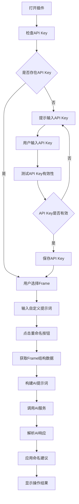

# Figma 自动命名插件产品文档

## 1. 产品概述

### 1.1 产品名称

AI-HLP Figma 自动命名插件

### 1.2 产品定位

一款基于 AI 技术的 Figma 插件，帮助设计师自动为设计元素生成语义化、规范化的命名，提高设计文件的可读性和可维护性。

### 1.3 核心价值

* **提高效率**：自动为多个设计元素生成合理命名，节省手动命名时间

* **规范命名**：统一设计元素命名规范，提高团队协作效率

* **语义化命名**：基于元素功能和上下文生成有意义的名称，提升设计文件可读性

* **智能识别**：AI 智能分析元素类型和功能，生成符合设计意图的命名

## 2. 核心功能

### 2.1 自动命名功能

* **单 Frame 处理**：用户选择单个 Frame，插件自动分析其中所有元素并生成命名建议

* **批量命名**：同时处理 Frame 内的所有元素，包括嵌套元素

* **AI 驱动**：使用火山 AI 模型生成语义化命名建议

* **自定义提示**：用户可输入自定义提示词，引导 AI 生成更符合特定场景的命名

### 2.2 API Key 管理

* **API Key 配置**：用户可在插件界面输入和保存火山 AI 的 API Key

* **API Key 验证**：提供 API Key 有效性测试功能

* **安全存储**：API Key 存储在 Figma 客户端本地存储中，确保安全性

### 2.3 命名规范管理

* **内置命名规则**：提供一套默认的命名规范和规则

* **元素类型规则**：针对不同类型的设计元素（文本、矩形、椭圆等）提供特定的命名规则

* **命名示例**：内置命名案例，帮助用户理解命名规范

### 2.4 错误处理与反馈

* **选择验证**：检查用户是否正确选择了 Frame

* **API 错误处理**：处理 API 请求失败的情况，提供友好的错误提示

* **操作反馈**：提供操作成功/失败的反馈信息

## 3. 用户流程

### 3.1 基本流程

1. **打开插件**：在 Figma 中打开插件
2. **选择 Frame**：在 Figma 画布中选择一个 Frame
3. **配置 API Key**（首次使用）：

   * 输入火山 AI 的 API Key

   * 测试 API Key 有效性

   * 保存 API Key
4. **设置命名参数**：

   * 输入自定义提示词（可选）
5. **执行命名**：点击"马上重命名"按钮
6. **查看结果**：

   * 插件自动分析 Frame 结构

   * 调用 AI 生成命名建议

   * 应用命名到对应元素

   * 显示操作结果

### 3.2 详细流程



## 4. 技术实现

### 4.1 技术栈

* **前端**：HTML、CSS、JavaScript

* **TypeScript**：用于 Figma 插件主逻辑

* **Figma Plugin API**：与 Figma 编辑器交互

* **火山 AI API**：提供命名生成能力

* **Fetch API**：用于与 AI 服务通信

### 4.2 核心模块

#### 4.2.1 插件主逻辑 (`main.ts`)

* **UI 管理**：显示和管理插件界面

* **消息通信**：处理 UI 与插件逻辑之间的消息传递

* **核心功能**：实现自动命名的完整流程

#### 4.2.2 界面模块 (`ui.html`)

* **用户界面**：提供 API Key 输入、测试和保存功能

* **操作界面**：提供自定义提示词输入和重命名按钮

* **反馈界面**：显示操作结果和错误信息

#### 4.2.3 命名规范模块

* **命名规则**：定义元素命名的规则和规范

* **元素类型规则**：为不同类型的元素提供特定的命名规则

* **命名示例**：提供命名案例参考

#### 4.2.4 AI 集成模块

* **API 配置**：管理 AI 服务的配置信息

* **提示词构建**：构建用于 AI 命名生成的提示词

* **AI 响应处理**：解析和处理 AI 生成的命名建议

### 4.3 关键功能实现

#### 4.3.1 Frame 结构分析

* 递归遍历 Frame 及其子元素

* 提取元素的基本信息（类型、位置、大小等）

* 根据元素类型提取额外信息（如文本内容、填充颜色等）

#### 4.3.2 AI 提示词构建

* 结合命名规范、元素类型规则和 Frame 结构数据

* 加入用户自定义提示词

* 构建结构化的提示词，引导 AI 生成符合要求的命名

#### 4.3.3 命名建议应用

* 递归遍历 Frame 及其子元素

* 根据元素 ID 匹配对应的命名建议

* 更新元素名称

### 4.4 数据结构

#### 4.4.1 Frame 结构数据

```javascript
{
  frameName: "HeaderFrame",
  width: 1200,
  height: 80,
  elements: [
    {
      id: "1:2",
      type: "TEXT",
      name: "Text 1",
      width: 200,
      height: 30,
      x: 20,
      y: 25,
      textContent: "Logo"
    },
    {
      id: "1:3",
      type: "RECTANGLE",
      name: "Rectangle 1",
      width: 1200,
      height: 80,
      x: 0,
      y: 0,
      fillColor: { r: 0, g: 0, b: 0, a: 1 }
    }
  ]
}
```

#### 4.4.2 命名建议数据

```javascript
{
  "1:2": "LogoText",
  "1:3": "HeaderBackground"
}
```

## 5. 命名规范(待补充)

### 5.1 基本规则

（待用户提供）

### 5.2 元素类型命名规则

（待用户提供）

### 5.3 命名示例

（待用户提供）

## 6. API 集成

### 6.1 火山 AI API

* **模型**：Doubao-Seed-1.8 251228

* **端点**：<https://ark.cn-beijing.volces.com/api/v3/chat/completions>

* **认证**：使用 API Key 进行认证，通过 Bearer Token 方式传递

### 6.2 API 请求格式

```bash
curl https://ark.cn-beijing.volces.com/api/v3/chat/completions \
  -H "Content-Type: application/json" \
  -H "Authorization: Bearer $ARK_API_KEY" \
  -d '{
    "model": "doubao-1-5-pro-32k-250115",
    "messages": [
        {
            "role": "system",
            "content": "You are a helpful assistant."
        },
        {
            "role": "user",
            "content": "Hello!"
        }
    ]
  }'
```

### 6.3 传输内容

**System 消息**：

```
任务：根据输入的'画框信息数组'，按照指定格式生成对应的'命名数组'。输入：包含 Figma 画框详细信息的'画框信息数组'，以及命名格式规则'命名格式规则'。输出：符合'命名格式规则'的'命名数组'，数组长度与输入数组一致，每个元素为对应画框的命名结果。范例：'画框信息数组a'→'命名数组a'
```

**User 消息**：

```
'画框信息数组'
```

其中：

* **画框信息数组**：插件在 Figma 获取的画框结构信息

* **命名格式规则**：命名规范的文本信息，Markdown 格式

* **命名数组**：AI 生成的命名结果，将填充到 Figma 中

### 6.4 API 响应处理

* 解析 API 响应，提取 AI 生成的内容

* 处理 JSON 格式的命名建议

* 容错处理，确保在 API 响应异常时仍能提供基本功能

## 7. 错误处理

### 7.1 常见错误

* **未选择 Frame**：用户未选择 Frame 或选择了非 Frame 元素

* **API Key 无效**：输入的 API Key 无效或已过期

* **API 请求失败**：网络问题或 AI 服务异常

* **AI 响应格式错误**：AI 返回的内容格式不符合预期

### 7.2 错误处理策略

* **用户友好提示**：提供清晰、易懂的错误提示信息

* **容错机制**：在 API 调用失败时提供降级方案

* **操作反馈**：及时向用户反馈操作结果和错误信息

## 8. 未来规划

### 8.1 功能扩展

* **多 Frame 支持**：同时处理多个选中的 Frame

* **批量操作**：支持对整个页面或多个页面的元素进行命名

* **命名风格定制**：允许用户自定义命名风格和规则

* **历史记录**：保存命名历史，支持撤销/重做操作

### 8.2 技术优化

* **性能优化**：提高大型 Frame 的处理速度

* **AI 模型优化**：使用更适合命名任务的 AI 模型

* **离线模式**：提供基本的离线命名功能

* **多语言支持**：支持中文等其他语言的命名

### 8.3 用户体验

* **可视化配置**：提供更直观的命名规则配置界面

* **实时预览**：在应用命名前提供预览功能

* **批量编辑**：允许用户批量编辑生成的命名建议

* **快捷键支持**：添加常用操作的快捷键

## 9. 安装与使用

### 9.1 安装方法

1. 克隆或下载插件代码
2. 在 Figma 中打开插件开发模式
3. 选择"导入插件"，指向插件目录
4. 插件将显示在 Figma 的插件列表中

### 9.2 使用方法

1. 在 Figma 中打开设计文件
2. 选择一个 Frame
3. 打开 AI-HLP 自动命名插件
4. 输入并验证 API Key（首次使用）
5. 输入自定义提示词（可选）
6. 点击"马上重命名"按钮
7. 查看命名结果

## 10. 总结

AI-HLP Figma 自动命名插件是一款基于 AI 技术的设计辅助工具，旨在帮助设计师提高工作效率，规范设计文件命名。通过智能分析设计元素结构和功能，结合 AI 技术生成语义化、规范化的命名建议，为设计师提供了一种全新的命名解决方案。

插件采用模块化设计，核心功能包括自动命名、API Key 管理、命名规范管理和错误处理。通过简洁直观的用户界面和流畅的操作流程，为用户提供了良好的使用体验。

未来，插件将继续扩展功能，优化技术实现，提升用户体验，为设计师提供更全面、更智能的命名工具。
